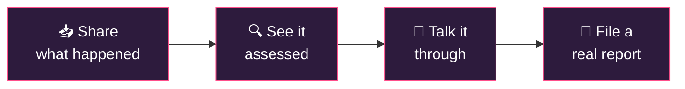
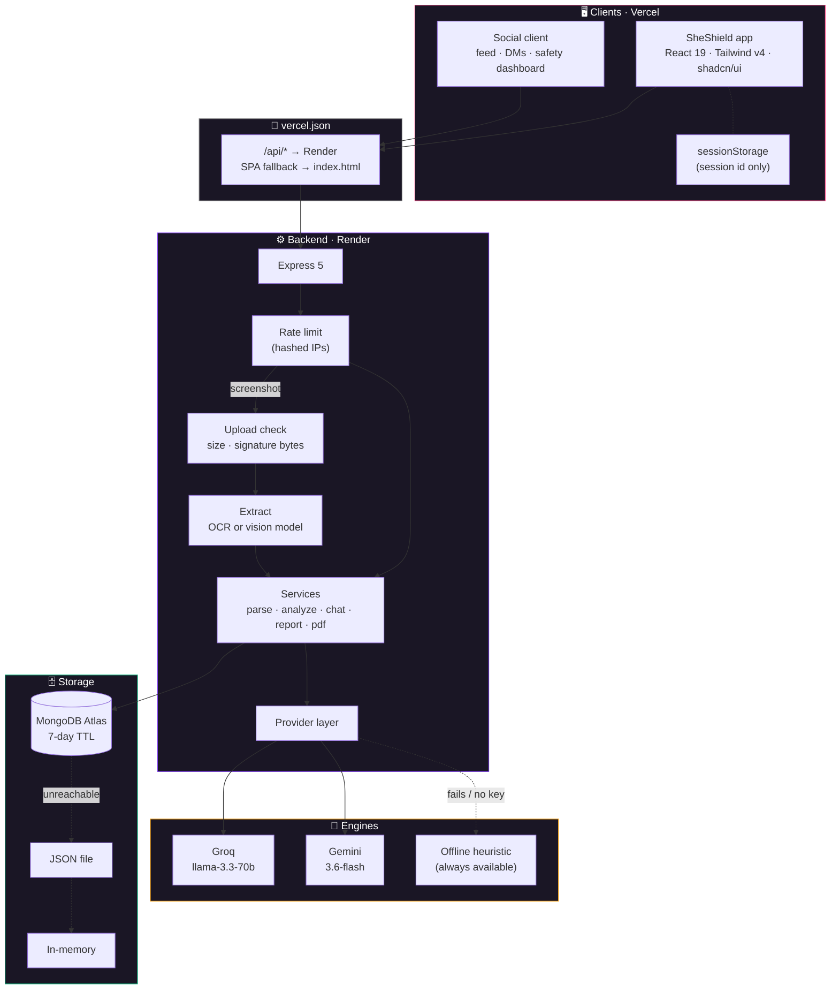
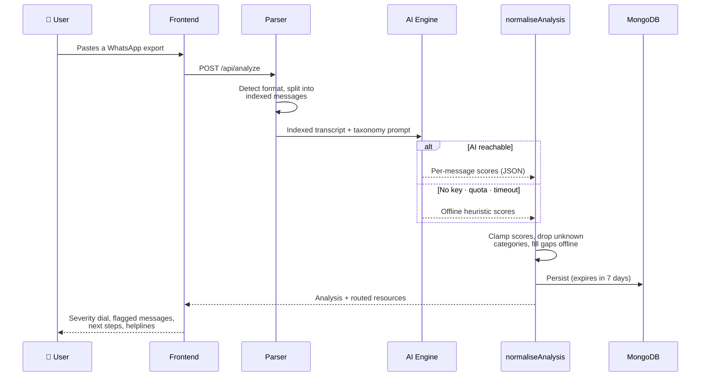
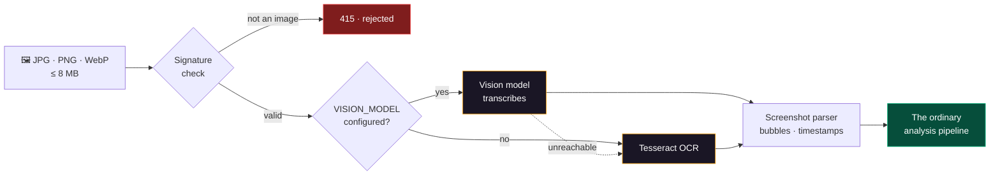
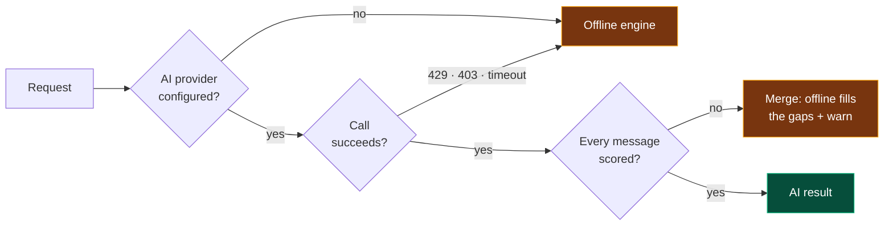
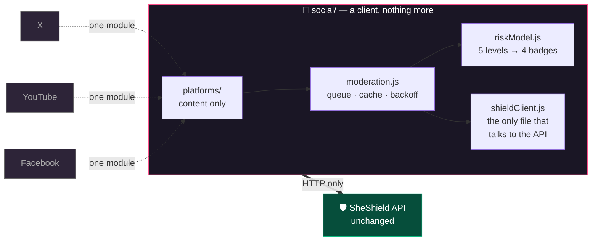

<div align="center">

# 🛡️ SheShield AI

**An AI-powered platform for detecting, supporting, and reporting cyber harassment against women.**

[](https://she-shield-ai-frontend.vercel.app)
[](https://sheshield-api-cfq5.onrender.com/health)


*Most platforms give you a report button and nothing else.*
*SheShield AI is the part that comes after.*

</div>

---

## The problem

A woman receiving threats on WhatsApp or Instagram has one option: a **Report** button that
disappears into a queue. Nothing tells her how serious it is. Nothing helps her keep evidence
before she blocks and loses it. Nothing explains which of India's helplines actually handles her
case, or what to write when she gets there.

So most incidents go unreported — not from indifference, but because the gap between *"this feels
dangerous"* and *"here is a complaint I can file"* is too wide to cross alone, usually at 2am,
usually while frightened.

**SheShield AI closes that gap in four steps.**

<div align="center">



</div>

---

## What it does

| | |
|---|---|
| 🔍 **Threat detection** | Per-message severity scoring (0–100) across **11 harm categories** — harassment, sexual harassment, threats, stalking, grooming, doxxing, sextortion, non-consensual imagery, impersonation, hate speech, financial exploitation. Detects escalation over time and names the behavioural pattern. |
| 🖼️ **Screenshots, not just text** | Upload a JPG, PNG or WebP of a chat. The text is read out with OCR and scored by the same pipeline, so the result is identical to a paste — and you are shown exactly what was recognised, to correct before it becomes evidence. |
| 💬 **Anonymous companion** | A trauma-informed chat companion. No account, no name, no email. Crisis language (self-harm, immediate danger) is intercepted **before** the model ever sees it and answered with helplines directly. |
| 📄 **Incident reports** | Flagged excerpts, timeline, and classifications compiled into a structured **PDF** for cybercrime.gov.in, a Cyber Crime Cell, or a platform's trust & safety team. |
| 🧭 **Guided reporting** | Helplines, portals, and NGOs routed by incident type **and** state — the Bengaluru CEN station, not a generic list. Plus an evidence-preservation checklist. |
| 📱 **Live screening in a feed** | A separate [social client](#the-social-client) puts the same engine inside an Instagram-style app — captions, comments, and DMs are scored **as they are written**, with warnings inline. |

### Severity model

Every message and every conversation lands on one of five bands:

| | Band | Score | What it means |
|---|---|---|---|
| 🟢 | **Safe** | 0–19 | Nothing matched a known harm pattern |
| 🔵 | **Low** | 20–39 | Uncomfortable, not yet threatening — worth documenting |
| 🟡 | **Medium** | 40–64 | A clear pattern of abuse — save evidence now |
| 🟠 | **High** | 65–84 | Targeted, sustained, or intimidating — preserve and report |
| 🔴 | **Critical** | 85–100 | Threats to safety, sextortion, imminent harm — treat as urgent |

---

## How it works

### Architecture



### The analysis pipeline



### Screenshots

Most people have a screenshot, not a text export. So an image is reduced to the thing the pipeline
already understands, and everything after that is identical — same scoring, same stored document,
same report.



Four things worth knowing:

- **The file's bytes decide what it is, not its name or its `Content-Type`.** Both are supplied by
  the client. Renaming a file to `.png` gets it past a mimetype check and no further.
- **Screenshots get their own parser.** The paste parser expects `Sender: text` with a leading
  timestamp; a screenshot has neither — the sender is *which side the bubble is on*, which OCR
  discards, and the time trails the message. Run through the paste parser, six bubbles collapse to
  three messages and `10:14 pm` is read as a sender named "10". `parseScreenshot` groups on the
  trailing timestamp instead. **The paste parser was not touched.**
- **You are shown what was read.** OCR misreads things, and this text may end up in a police
  complaint — so the recognised text is displayed with its confidence score and a button to correct
  it and re-run.
- **Attribution is honestly incomplete.** With the bubble geometry gone there is no way to separate
  her replies from theirs, so every line is attributed to one sender and the UI says so.

Nothing is written to disk: the image is held in memory for the length of the request and never
persists. Only the analysis is stored, plus a small `source` record — the method, engine, and
confidence, never the filename.

### Graceful degradation

The single most important property: **support never goes dark.**



No API key, exhausted quota, or an unreachable model still produces a scored conversation, a
supportive reply, and a filable PDF. The UI always says which engine ran.

---

## The social client

Everything above works on a conversation you've *already* had. The `social/` workspace answers the
other half: what if the screening ran **while the harm was arriving**?

It's an Instagram-style app — feed, posts, comments, likes, DMs — where every caption, comment, and
message is scored by SheShield before it settles on screen. Harmful content gets a coloured badge
and a warning inline, high-severity content stays blurred until tapped, and one button turns any
flagged item into the same filable incident report the main app produces.

<div align="center">



</div>

**Not one line of `backend/` or `database/` changed to build it.** It uses the endpoints that were
already there, over HTTP, like any third-party would.

### Why it is split this way

| Boundary | Owns | So that… |
|---|---|---|
| [`shieldClient.js`](social/src/lib/shieldClient.js) | The **entire** API surface | No component can quietly invent a second way to call SheShield |
| [`platforms/`](social/src/platforms/index.js) | Content — posts, comments, threads | Adapters know nothing about screening |
| [`riskModel.js`](social/src/lib/riskModel.js) | Level → badge collapse | The backend keeps its own five-band vocabulary |
| [`moderation.js`](social/src/lib/moderation.js) | Queue, cache, backoff | Rate limits are handled once, not per component |

Adding **X, YouTube, or Facebook** is one module satisfying the [adapter
contract](social/src/platforms/index.js) plus one line in the registry. The AI backend, the
moderation pipeline, and every component stay untouched — that is the whole point of the split.

### Two backend constraints the client absorbs

Rather than change the API, the client is built around its limits:

- **20 analyses per minute.** A scrolling feed would exhaust that instantly, so content is screened
  **once at creation**, verdicts are cached across reloads, and the queue runs serially and honours
  `Retry-After` instead of retrying into the limiter.
- **A session keeps only its last 20 analyses.** The dashboard treats the backend as the store of
  record *and says so on screen*, while keeping a local index so history doesn't silently vanish at
  the cap.

### Two safety choices

- 🚫 **A failed screening reads "Not screened" — never "Safe."** An absent verdict is *unknown*, not
  clean. Collapsing those two would be the most dangerous thing this UI could do.
- 🌫️ **High and Critical content is blurred behind one tap, not removed.** Being ambushed by abuse is
  distressing; deleting it destroys evidence. She chooses when to look.

```bash
npm run dev:social      # http://localhost:5274
```

The seed feed deliberately contains real harm patterns — a suicide-baiting comment, a stalking
comment, and a sextortion DM thread — so the safety layer is visible immediately instead of being an
empty green wall.

---

## Design decisions worth knowing

> These are the choices that matter more than the feature list.

- 🕶️ **Anonymous by construction.** No login, because there is nothing to log in to. The session id
  is the only handle, lives in `sessionStorage`, and expires. Even the rate limiter hashes IPs — it
  has no business holding the address of someone reporting her own harassment.
- 🚪 **Quick exit.** `Esc` ×3 (or the button) wipes local state and *replaces* the history entry, so
  Back doesn't return here. Built for someone whose screen might be looked at.
- 🌫️ **Flagged text starts blurred.** Re-reading abuse is re-living it. She chooses when.
- 🚨 **Crisis is intercepted before the model.** Self-harm and immediate-danger language never
  reaches an LLM; it gets helplines directly, deterministically.
- 📝 **Nothing is invented.** Report fields she didn't supply render as `[not provided]`, never
  guessed — a fabricated date in a police complaint is worse than a blank one.
- 🔇 **Never silently "safe".** If a model skips messages, the offline engine scores them and the
  overall severity rises to the worst one it missed. Telling a woman a threat is safe is the most
  dangerous thing this app could do.
- 🌙 **Dark by default.** It is often opened late at night, in bed, by someone who doesn't want a
  bright screen announcing what she's reading.

---

## Tech stack

| Layer | Choice | Why |
|---|---|---|
| **Frontend** | React 19 · Vite · Tailwind v4 | Fast HMR, CSS-first theming |
| **UI** | shadcn/ui · Radix · Framer Motion | Accessible primitives, owned in-repo |
| **Motion** | Aceternity-style hero · Magic UI-style dashboard | Aurora, spotlight, bento, number tickers |
| **Backend** | Node 20+ · Express 5 (ESM) | Long-running process, no cold starts per request |
| **AI** | Groq (`llama-3.3-70b`) or Gemini — swappable | One entry in a provider map |
| **Image → text** | Tesseract (WASM) · optional vision model | Pure WASM: no native build, same on a laptop and a free instance |
| **Uploads** | Multer, memory storage | A screenshot of someone's harassment never touches disk |
| **PDF** | PDFKit | Server-side, WinAnsi-sanitised |
| **Database** | MongoDB Atlas + JSON-file + in-memory | One interface, three adapters |
| **Social client** | Its own Vite app, same stack | A pure API consumer — proves the boundary holds |

---

## Project structure

```
sheshieldai/
├── database/                  # @sheshieldai/database — shared data layer
│   └── src/
│       ├── taxonomy.js        # categories + severity levels — the shared vocabulary
│       ├── schema.js          # document shapes + normalisation of model output
│       ├── index.js           # adapter selection, session resolution, retention
│       └── adapters/          # mongo · jsonFile · memory (identical interface)
│
├── backend/                   # @sheshieldai/backend — API
│   ├── src/
│   │   ├── index.js           # Express app, CORS, error handling, shutdown
│   │   ├── config.js          # env → config, provider selection
│   │   ├── middleware/        # hashed-IP rate limiting, image upload validation
│   │   ├── providers/
│   │   │   ├── index.js       # provider selection — services never import a vendor
│   │   │   ├── prompts.js     # shared prompts, so backends can't drift
│   │   │   ├── groq.js        # OpenAI-compatible, plain fetch
│   │   │   ├── gemini.js      # structured output + thinking-token guards
│   │   │   └── heuristic.js   # offline classifier, no network
│   │   ├── routes/            # session · analyze · chat · report
│   │   └── services/
│   │       ├── extract/       # image → text: ocr (tesseract) · vision · strategy registry
│   │       └── …              # parse · analyze · chat · report · pdf · resources
│   └── test/smoke.mjs         # 21 tests — no key, no network
│
├── frontend/                  # @sheshieldai/frontend — React app
│   ├── vercel.json            # /api proxy + SPA fallback (must live here)
│   └── src/
│       ├── lib/               # api client, session handling, AppContext
│       ├── components/
│       │   ├── ui/            # shadcn primitives
│       │   ├── aceternity/    # aurora background, spotlight, text reveal
│       │   ├── magic/         # number ticker, shine border, bento grid
│       │   └── layout/        # navbar, footer, quick exit
│       └── pages/             # Landing · Dashboard · Analyze · Companion · Report · Resources
│
└── social/                    # @sheshieldai/social — social feed client
    └── src/                   # talks to the API over HTTP only; owns no AI logic
        ├── lib/
        │   ├── shieldClient.js   # the entire SheShield API surface — nothing else calls it
        │   ├── moderation.js     # serial queue, verdict cache, 429 backoff
        │   ├── riskModel.js      # five backend levels → four badges
        │   └── useModeration.js  # useSyncExternalStore bindings
        ├── platforms/
        │   ├── index.js          # registry + adapter contract (add X/YouTube/FB here)
        │   └── instagram.js      # content adapter, localStorage-backed
        ├── components/           # RiskBadge · AiWarning · ScreenedText · FullReportDialog · PostCard
        └── pages/                # Feed · Create · Messages · Safety
```

> The dependency arrow only ever points **one way**: `social/` and `frontend/` depend on the API;
> nothing in `backend/` or `database/` knows either of them exists.

---

## Quick start

Requires **Node 20+**.

```bash
git clone https://github.com/rohithmt18/SheShield-AI.git
cd SheShield-AI
npm install
cp backend/.env.example backend/.env    # optional — it runs without this
npm run dev
```

| | | |
|---|---|---|
| 🖥️ **SheShield app** | http://localhost:5273 | `npm run dev` |
| ⚙️ **API** | http://localhost:5050 | `npm run dev` |
| 📱 **Social client** | http://localhost:5274 | `npm run dev:all` |

`npm run dev` starts the app and the API; `npm run dev:all` adds the social client. Vite proxies
`/api` to the backend in every case, so there is no CORS setup in dev.

**These ports are fixed, not preferences.** Vite's default is to slide to the next free port when
one is taken, which produces a page on an origin the backend has never heard of — so the app loads
and then every API call fails, which reads like a broken backend rather than a leftover process. So
`strictPort` is on and a preflight refuses to start anything, naming the process in the way:

```text
✖ 1 of this project's ports is already in use.

  5274  Social client
    PID 17972  node.exe
    stop it with:  taskkill /PID 17972 /F
```

Run it on its own with `npm run check:ports`.

### Configuration

Everything in `backend/.env` is optional. **With an empty file you still get a working app** — the
offline engine and in-memory storage.

> ⚠️ `backend/.env.example` is **committed to git**. Real keys go in `backend/.env`, which is ignored.

| Variable | Default | Notes |
|---|---|---|
| `AI_PROVIDER` | auto | `groq` or `gemini`. Unset → whichever key is present, Groq first |
| `GROQ_API_KEY` | — | Free key at [console.groq.com/keys](https://console.groq.com/keys) |
| `GROQ_MODEL` | `llama-3.3-70b-versatile` | Any Groq chat model |
| `GEMINI_API_KEY` | — | Free key at [aistudio.google.com/apikey](https://aistudio.google.com/apikey) |
| `GEMINI_MODEL` | `gemini-3.6-flash` | `gemini-2.5-flash` is retired for new keys |
| `MONGODB_URI` | — | Atlas free M0. Falls back to `DATA_FILE` if unreachable |
| `MONGODB_DB` | `sheshieldai` | |
| `DATA_FILE` | `./.data/sessions.json` | Set empty to force in-memory |
| `RETENTION_DAYS` | `7` | Enforced by a Mongo TTL index |
| `VISION_MODEL` | — | A multimodal Groq model reads screenshots instead of OCR. OCR stays as the fallback |
| `MAX_IMAGE_BYTES` | `8388608` | 8 MB upload ceiling |
| `OCR_LANGUAGES` | `eng` | `+`-joined Tesseract packs, e.g. `eng+hin` |
| `OCR_CACHE_DIR` | `./.data/tessdata` | Caches the ~10 MB language pack across cold starts |
| `PORT` | `5050` | Don't set this on Render — it injects its own |
| `CORS_ORIGIN` | *(dev origins)* | Comma-separated. **Adds** to `localhost`/`127.0.0.1` on 5273 + 5274 in dev; **replaces** them in production. **Must be set in production** |

**Storage priority:** `MONGODB_URI` → `DATA_FILE` → in-memory.

### Tests

```bash
npm test
```

21 tests covering the parser, the offline classifier, region routing, every endpoint, PDF
generation, and the unscored-message guard. They force the offline path, so they need **no API key
and no network** — and they clear every provider key explicitly, so they behave identically from
any working directory.

---

## API

| Method | Endpoint | |
|---|---|---|
| `GET` | `/health` | Storage backend, active AI engine, CORS allowlist |
| `GET` | `/api/meta` | Categories, levels, regions, helplines |
| `POST` | `/api/session` | Create or resume an anonymous session |
| `GET` `DELETE` | `/api/session/:id` | Fetch, or erase everything held |
| `POST` | `/api/analyze` | Score a conversation (raw text or structured messages) |
| `POST` | `/api/analyze/image` | Score a screenshot — `multipart/form-data`, JPG/PNG/WebP ≤ 8 MB |
| `POST` | `/api/analyze/preview` | Parse without scoring |
| `POST` | `/api/chat` | Companion reply |
| `GET` `DELETE` | `/api/chat/:sessionId` | Transcript, or clear it |
| `POST` | `/api/report` | Build an incident report |
| `GET` | `/api/report/:sessionId` | Fetch the report |
| `GET` | `/api/report/:sessionId/pdf` | Download it as PDF |
| `GET` | `/api/resources` | Directory filtered by category, level, region |

<details>
<summary><b>Example — analyse a conversation</b></summary>

```bash
curl -X POST http://localhost:5050/api/analyze \
  -H "content-type: application/json" \
  -d '{
    "text": "12/03/2024, 10:31 pm - Ravi: i know where you live\n12/03/2024, 10:32 pm - Ravi: send a pic or ill leak the ones i have",
    "sourceLabel": "WhatsApp",
    "region": "karnataka"
  }'
```

```jsonc
{
  "sessionId": "ss_9bd4eb490247",
  "analysis": {
    "engine": "groq",
    "overallSeverity": 95,
    "level": "critical",
    "escalating": true,
    "categories": ["threat_of_violence", "sextortion"],
    "summary": "You are experiencing severe blackmail and intimidation…",
    "messages": [
      { "index": 0, "flagged": true, "severity": 85, "categories": ["threat_of_violence"] },
      { "index": 1, "flagged": true, "severity": 95, "categories": ["sextortion"] }
    ],
    "resources": {
      "urgent": true,
      "region": { "name": "Karnataka", "unit": "CEN Police Station (Bengaluru City)" }
    }
  }
}
```

</details>

---

## Deployment

### Backend — Render

| Setting | Value |
|---|---|
| **Root Directory** | *(leave blank)* |
| Build Command | `npm install` |
| Start Command | `npm start` |

> ⚠️ Root Directory **must be blank**. `backend` depends on `@sheshieldai/database` as a workspace,
> so npm has to install from the repo root. Point Render at `backend/` and the build fails with
> `404 '@sheshieldai/database' is not in this registry` — and Render keeps serving the last good
> image, so it looks like deploys are being ignored.

Environment: `NODE_ENV=production`, `GROQ_API_KEY`, `GROQ_MODEL`, `MONGODB_URI`, `MONGODB_DB`,
`CORS_ORIGIN`, and optionally `VISION_MODEL`. **Do not set `PORT`** — Render injects it.

MongoDB Atlas needs **Network Access → `0.0.0.0/0`**, since the free tier has no static outbound IP.

> ⚠️ **Two services, one push.** Vercel and Render deploy independently, so a change that adds an
> API route lands on the frontend first and the new call 404s until Render catches up. If a feature
> works locally but not in production, check **Auto-Deploy** and the **Events** tab before touching
> the code — a failed build leaves the previous version serving, which looks identical to a bug.
>
> `GET /health` is the quickest way to tell which build is live:
>
> ```bash
> curl -s https://your-api.onrender.com/health
> # {"ok":true,"storage":"mongodb (…)","ai":"groq","imageText":"OCR (Tesseract)", …}
> #                                                 ^ absent on a build without image analysis
> ```

### Frontend — Vercel

| Setting | Value |
|---|---|
| **Root Directory** | `frontend` |
| Build Command | `npm run build` |
| Output Directory | `dist` |

Vercel reads `vercel.json` **relative to the Root Directory**, so the config lives at
[`frontend/vercel.json`](frontend/vercel.json). Put it at the repo root with Root Directory set to
`frontend` and it is silently ignored — which surfaces as *"No Output Directory named `dist`"*.

That file does two things:

- rewrites `/api/*` to the Render service, keeping the browser same-origin
- falls back to `index.html`, so `/dashboard` and `/analyze` survive a refresh

The Render URL in it is hardcoded — update it if the service is renamed. Alternatively drop the
first rewrite and set `VITE_API_URL` to the backend's URL.

### Social client — Vercel *(optional)*

Deployed exactly like the frontend, as a **second Vercel project** on the same repo with Root
Directory `social` and its own [`social/vercel.json`](social/vercel.json). It needs no backend
change — but its domain must be **added to `CORS_ORIGIN`** alongside the main app's, comma-separated:

```
CORS_ORIGIN=https://she-shield-ai-frontend.vercel.app,https://your-social-app.vercel.app
```

### ⚠️ The CORS trap

`CORS_ORIGIN` **must** be set to the frontend's URL, even behind the rewrite. Vercel forwards the
browser's `Origin` header to the backend, and a deployed browser's origin is never the localhost
default.

What makes this vicious: **`curl` sends no `Origin` header**, and origin-less requests are allowed
by design (server-to-server needs that). So the API returns `200` to every terminal check while
every real visitor gets `403`. Worse, the browser blocks the response before JavaScript sees it, so
the frontend reports *"service unreachable"* rather than *"origin rejected"*.

```bash
# ❌ passes even when the site is completely broken
curl https://your-api.onrender.com/api/meta

# ✅ what actually matters
curl -H "Origin: https://your-app.vercel.app" https://your-api.onrender.com/api/meta
```

`GET /health` reports the live allowlist, and the server logs a warning at startup if it is running
in production without one.

---

## Scope and honesty

**Ingestion.** The original brief describes continuously monitoring connected social accounts. Meta,
X, and Google do not expose another person's DMs to third-party apps, so that needs platform
partnerships, not OAuth. What is built is the same detection pipeline against **paste and file
upload** — WhatsApp exports (both formats), Instagram DMs, or anything pasted.

**The social client is a client, not a connector.** It shows exactly what continuous in-feed
screening looks and feels like, and it is wired to the real API — but its posts and DMs come from a
**local adapter with seeded content**, not from Instagram. `platforms/instagram.js` is a stand-in
for an API that would return this shape *if* such access were granted. The value it proves is the
half that is genuinely hard: the pipeline, the pacing, the UI, and the boundary. Swapping the
adapter for a real feed changes one file.

**The severity score is an automated assessment**, not a legal or professional risk determination.
It can be wrong in both directions. The UI and every generated PDF say so.

**Legal references are informational.** Provisions (BNS, IT Act, POCSO) are cited to help someone
describe what happened, not to advise. Every report ends by saying it is not legal advice.

**Region coverage** is 10 states plus national resources. Helpline numbers were correct when written
and should be re-verified before any real deployment.

---

## Known issues

- **Gemini 3.x thinking tokens** are billed against `maxOutputTokens` — a chat turn spends ~700–900
  tokens reasoning before writing a word, so a generous-looking budget silently returns a truncated
  fragment. Guarded in [`gemini.js`](backend/src/providers/gemini.js): the chat path budgets 2048
  tokens with `thinkingLevel: 'low'` (Gemini 3+ only — `thinkingBudget` is rejected there and vice
  versa), and a `MAX_TOKENS` finish under 80 characters is treated as a failure so the offline
  responder takes over.
- **Groq free tier is 12,000 TPM.** A long conversation plus an immediate report can exceed it. It
  degrades to the offline engine with a visible notice rather than erroring.
- **Render free tier sleeps** after ~15 minutes idle; the first request then takes ~50s. The
  frontend retries across that window rather than declaring the API dead.
- **OCR is heavy for a 512 MB instance.** Tesseract downloads a ~10 MB language pack on first use
  and holds it in memory, and Render's disk is ephemeral, so the download repeats after every cold
  start — the first screenshot is slow, the rest are not. If the instance runs out of memory, set
  `VISION_MODEL` and the model reads the image instead: no worker, no download, no memory spike, and
  OCR stays as the fallback. That is an env var, not a code change.
- **Deploying the frontend without the backend produces a 404**, which the API answers with its
  generic *"Unknown endpoint."* Anything that adds a route — image analysis did — needs **both**
  services redeployed. The upload path names this case rather than passing the server's message
  through, and `GET /health` lists `imageText` only on a build that has the feature.
- `npm audit` reports a high-severity advisory in `react-router`
  ([GHSA-qwww-vcr4-c8h2](https://github.com/advisories/GHSA-qwww-vcr4-c8h2)). It affects **RSC mode**
  CSRF handling; this is a plain client-side `BrowserRouter` SPA with no server actions, so it is not
  reachable. The advisory range (`7.12.0 – 8.2.0`) covers every published 7.x, so there is no patched
  version to move to yet.
- The frontend bundle is ~574 kB (184 kB gzipped) in one chunk. Route-level `React.lazy` would fix it.

---

<div align="center">

**If you are in immediate danger, call 112.**
Women's helpline **181** · Cyber crime **1930** · Mental health **14416**

<sub>SheShield AI gives automated assessments, not legal advice.<br/>
Sessions are anonymous and deleted automatically.</sub>

</div>
